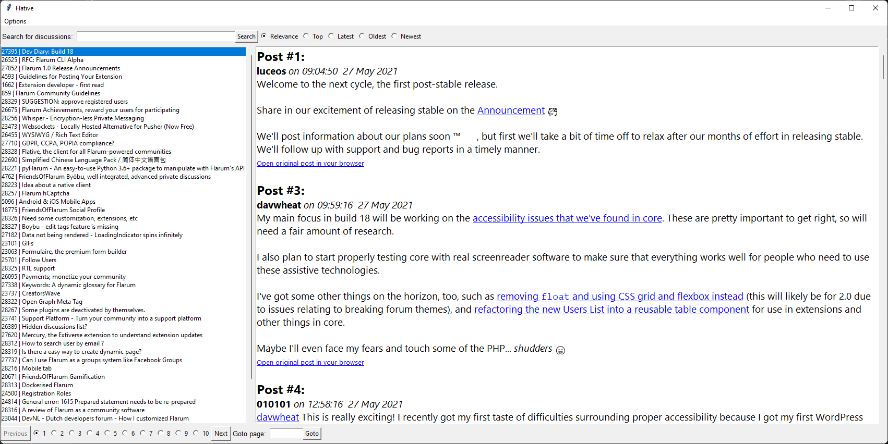

# Flative
A native client for your Flarum-powered communities



## Setup
```sh
# setup dependancies
pip install -r requirements.txt
# launch the app
python3 main.py
```

### Compile
For compile it with PyInstaller for your current platform, use `pyinstaller --onefile --noconsole --add-data locales;locales -n flative main.py`.

## Contribution
### Translations
We store all locales files in `locale` folder. We use [https://poedit.net](Poedit) as our main translations editor. We planned to use Weblate in the future.

## License
This repository is licensed under the [MIT license](LICENSE).
